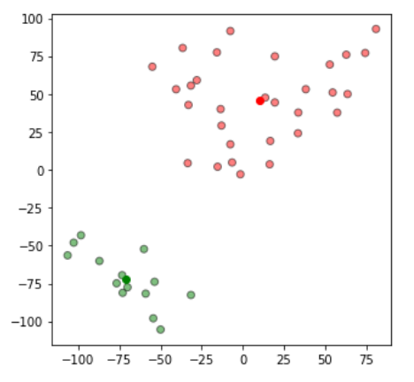

# K-Means report
## Clustering for mosquito populations in space

### Artificial inteligence

      Esteban Quintana Cueto - A01184855
      Javier Rodríguez Caballero López - A01152572

Profesor: Ruben Stranders

### Introduction
In this project we developed the algorithm K-Means from scratch. K-Means is a classification algorithm used to cluster numeric data. With this project we want to classificate meta-populations of mosquitos into populations. At the same time, we'll also make an analysis of the algorithm and mention in which kind of problems this algorithm is useful and in which ones it can come up with wrong results.

### Justification
The challenge was chosen thinking about the global problem of the mosquitos. In this case we have a dataset of mosquito meta-population locations and we want to cluster them in order to ease the visualization of the relation between these populations.

### The algorithm
    1.- Given a number of data points in space
    2.- Select K number of clusters, then randomly place them around the 'plot'.
    3.- Calculate the distances between each data point and the centroids.
    4.- Assign a data point to the closest centroid.
    5.- Recalculate the new cluster using the means of all clustered data points.
    6.- Recalculate distances between data points and centroids.
    7.- When the points doesn't change of cluster anymore, break. Else continue.

### Setting up instructions
After installing Python3, run the following commands from the terminal:

    $ python3 -m pip install jupyter
    $ pip install pandas
    $ pip install numpy
    $ pip install matplotlib

### Analysis
After the implementation of K-Means, we tested the algorithm using the dataset of mosquitoes locations. We clustered the data and evaluated the results. Here's an image of the results:

In this case, we calculated two clusters and the results are correct, the metapopulations are classified in the right way. At first glance we can visualize which are the two clusters without the need for colors.

On the other hand, we also analyze counterexamples in which K-Means can throw incorrect results. Here's one:

In this case, at first glace we can see that there's two clusters, one that is the circle in the middle, and the other one is the circle on the outside. But since K-Means is a non-deterministic algorithm the results may vary and bring wrong results: it may sometimes place the random first random centroids in non-conveninent place, or even there are some problems like this one, where placing the new centroids in the mean of the data points will result in having our data clustered like the one this example.

### Conclusion and future work
K Means can be a very good algorithm for classifying numerical data, it can give a good idea of how the elements in the dataset are related. This can be applied to different kinds of projects in different areas. Such as image compression, robot vision and astronomy.

There are many considerations to take when implementing K Means, mainly having in mind that it is not a deterministic algorithm, it can come up with different solutions for each execution at times. And it can also fail at placing the centroids depending on the type of dataset used, in those cases we recommend using varations of K Means, such as K Means++.

Also, the K Means implementation in this project could be improved by finding a way to automatically calculate the number of clusters present in the data without the need of the user entering it.

### References
Trevino, A. (n.d.). Introduction to K-means Clustering. Retrieved from https://www.datascience.com/blog/k-means-clustering

Forgy, E. W. (1965). Cluster analysis of multivariate data: efficiency vs interpretability of classifications. Biometrics, 21, 768--769.
